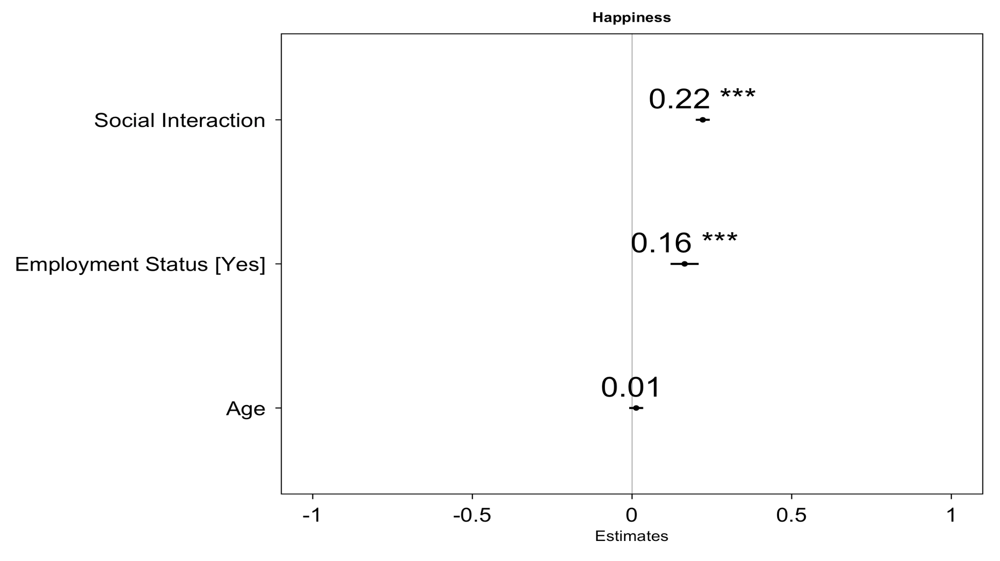

# About me

### Research Insects
- Mental Well-being
- Social Engagement

## Education
- B.A. Psychology | University of Toronto May 2026 _(Expected)_

# Research Project
Does Employment status and social engagement predict someone's well-being?

## Objectives
- Well-being highly related to an individuals life satisfaction and happiness (Benjamin et al., 2014)
- High rates of anxiety often associated with insecure employment (Wolff, A. D., 2008)
- Those who expect better employment outcomes are happier (Wolff, A. D., 2008)
- Happiness increases with more social exchanges. (Masterson et al. 2021)
- Any forms of social ties can lead to increased well-being (Sandstrom & Dunn., 2014)
- While employment status and social interaction can each lead to varying levels of well-being, are they both able to serve as an indicator?
- Which variable acts as a stronger indicator?

## Approach
Participants
- N = 7644 adults from an open source dataset in [National Wellbeing Survey](https://www.icpsr.umich.edu/web/ICPSR/studies/38964), a US research study (Monnat et al. 2022)
  - Adults aged 18 to 64 recruited online via Qualtrics sending surveys to emails.
  - *M*age = 41; *SD*: 13.6
  - 47.8% Male, 51.8% Female, 0.5% Other

Measures
- Life Satisfaction measured through Diemer Satisfaction With Life Scale
  - Cronbach alpha: 0.864
  - Life Satisfaction Factor Loading range: 0.573 - 0.859
- Happiness measured via one prompt:
  - *“Taking all things together, would you say you are: Very Happy, Rather Happy, Not Very Happy, Not At All Happy.”*
- Employment Status measured by two items:
  - Yes or no to “One Job”, *“Multiple Jobs”*
- Social Interaction measured via one prompt:
  - *“Thinking about the past 12 months, how often did you engage in the following activities? Get together socially with friends or relatives.”*
 
## Findings
Pearson correlations between independent and dependent variables
- Age added as a control variable
- Significant weak positive correlation between Employment status, Social Interaction and Life Satisfaction
- Significant weak positive correlation between Employment status, Social Interaction and Happiness
- Significant strong postive correlation between Life Satisfaction and Happiness

Can employment status and social interaction predict Life Satisfaction?
- The results show that individuals who are employed and have higher amounts of social interaction leads to higher life satisfaction.

Can employment status and social interaction predict Happiness?
- The results show that individuals who are employed and have higher amounts of social interactions leads to higher happiness.

# Impact
- Happiness and Life Satisfaction strong positive correlation represent strong indicators of well-being.
- Employment and increased social interactions predicts higher SWL and happiness.
- Both variables are able to predict an individual's well-being.
- However, happiness and life satisfaction are both better predicted by Social interaction frequency.
- Therefore to determine someone's well-being, social interactions may act as a better indictor.
- Strengths: Large sample size ensures strong validity and generalizability across the population.
- Limitations: Sample collected during during the pandemic in which evaluations of satisfaction with life and happiness may be different compared to post pandemic times.
- Next step: Replicate the study in post pandemic times to ensure generalizability across pressures and time.

## Publications

1. Benjamin, D. J., Heffetz, O., Kimball, M. S., & Szembrot, N. (2014). Beyond Happiness and Satisfaction: Toward Well-Being Indices Based on Stated Preference. The American Economic Review, 104(9), 2698–2735. https://doi.org/10.1257/aer.104.9.2698
2. De Wolff, A., National Collaborating Centre for Determinants of Health., & National Collaborating Centre for Determinants of Health. (2008). Employment insecurity and health: synthesis paper. NCCDH.
3. Grün, C., Hauser, W., & Rhein, T. (2010). Is Any Job Better than No Job? Life Satisfaction and Re-employment. Journal of Labor Research, 31(3), 285–306. https://doi.org/10.1007/s12122-010-9093-2
4. Masterson, C., Sun, J., Wayne, S. J., & Kluemper, D. (2021). The roller coaster of happiness: An investigation of interns’ happiness variability, LMX, and job-seeking goals. Journal of Vocational Behavior, 131, 103654-. https://doi.org/10.1016/j.jvb.2021.103654
5. Monnat, Shannon M., Zhang, Xue, Sun, Yue, Wiemers, Emily E., Wolf, Douglas A., and Montez, Jennifer Karas. National Wellbeing Survey, United States, 2022. Inter-university Consortium for Political and Social Research [distributor], 2024-05-30. https://doi.org/10.3886/ICPSR38964.v2
6. Sandstrom, G. M., & Dunn, E. W. (2014). Social Interactions and Well-Being: The Surprising Power of Weak Ties. Personality & Social Psychology Bulletin, 40(7), 910–922. https://doi.org/10.1177/0146167214529799

